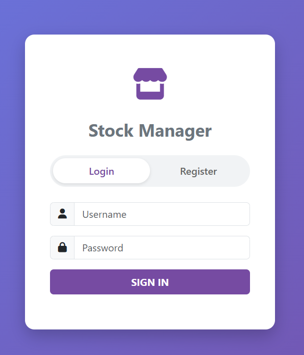
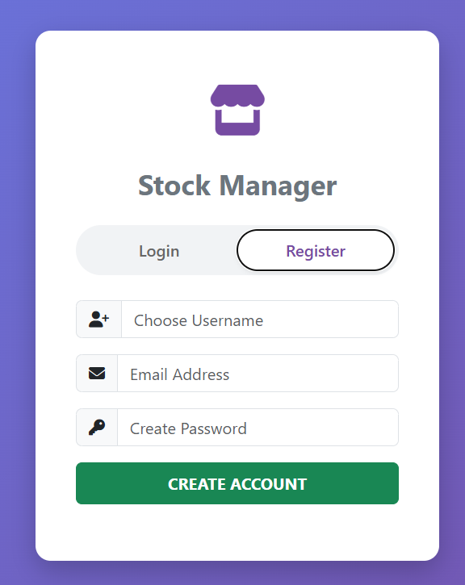
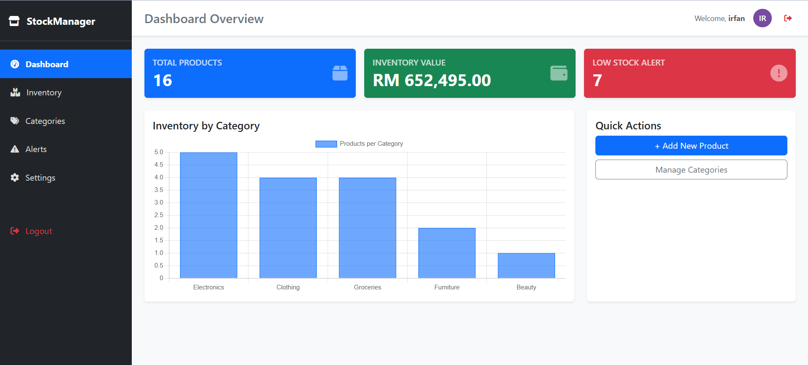
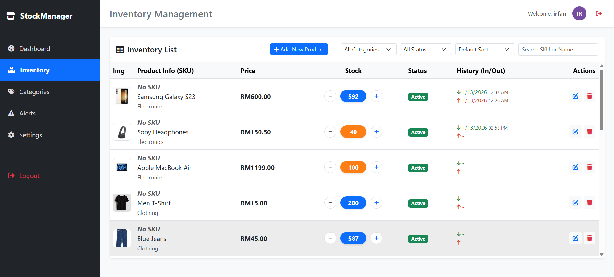
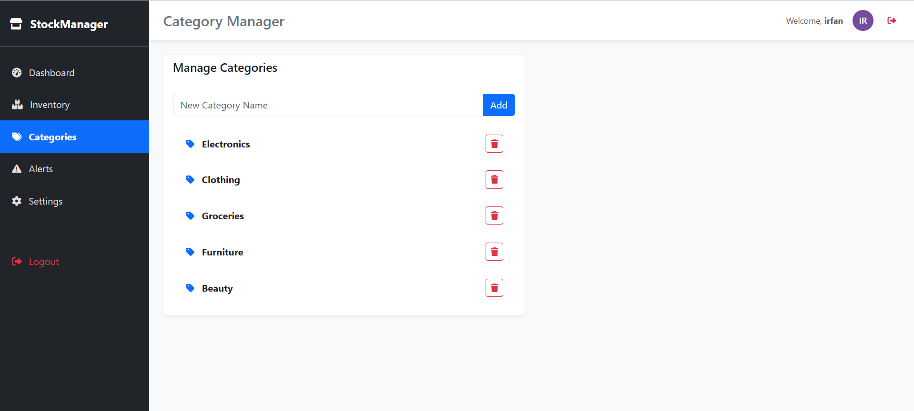
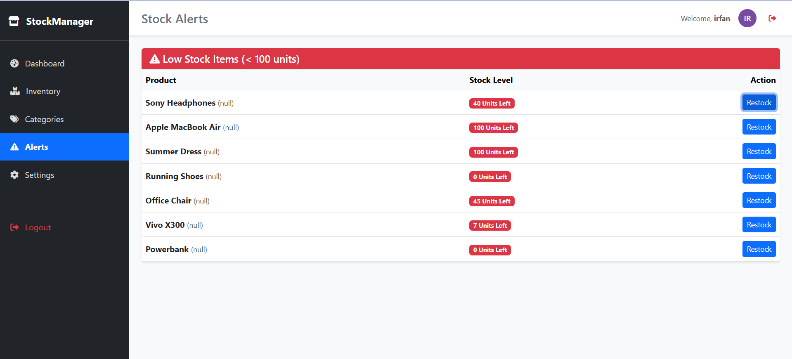
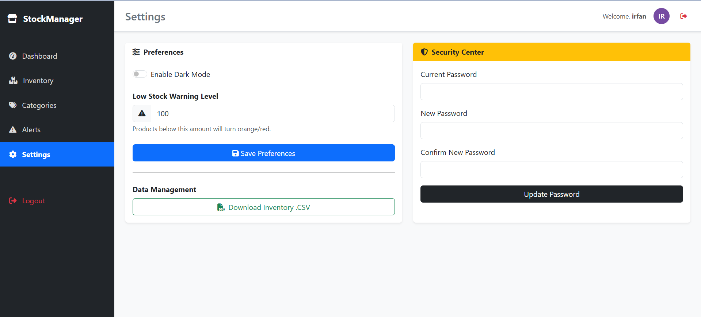

Assignment – Full-Stack Application

Objective
Build a full-stack web application, Stock Management System

Backend: Java Spring Boot
• User Login & Register
• CRUD
• Database: PostgreSQL
• RESTful API

Frontend: 
• HTML/CSS/JavaScript

Git Version Control
• Clear commit history

Features
• Search/Filter/Sorting
• File/Image Upload
• Application Logging
• Responsive/Clean UI

## Preview Project

